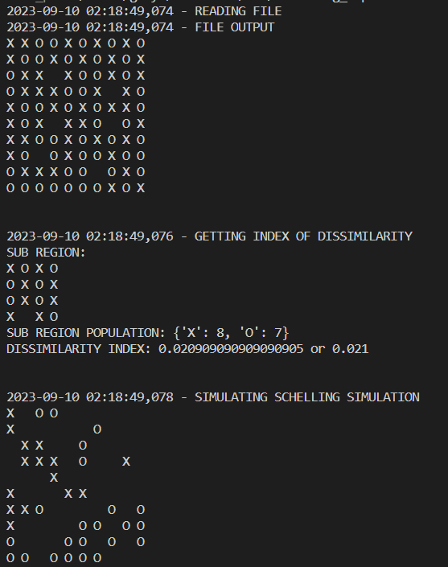
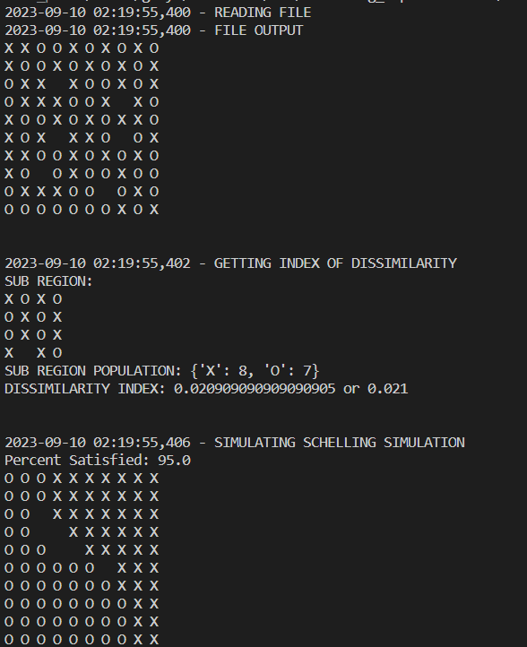
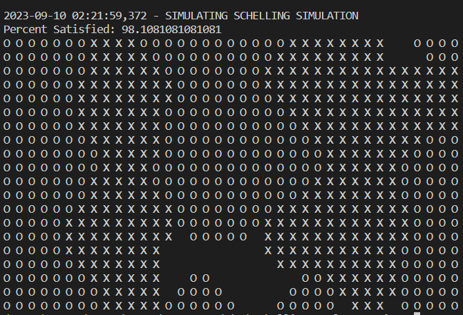

# Schelling Implementation

 

The Schelling's Model of Segregation is a model that showcases how individuals are inclined to segregate amongst themselves. By this we are able to model the behvaior of how individuals would likely segregate amongs their respective groups.

  <h2>Table of Contents</h2>
	  <ol>
	    <li>
		    <a href="#intro">Introduction</a>
	    </li>
	    <li><a href="#fs">Folder Structure</a></li>
		<li><a href="#ag">Arguments</a></li>
		<li><a href="#rs">Results</a></li>
        <li><a href="#ref">References</a></li>
	</ol>

<h2 id="intro">Introduction</h2>
The project aims to create a script that would recreate Schellings model, specifically the following functionality:

- To create a script that can run through the command line taking in arguments for the model parameters
- To compute the Index of Dissimilarity for a given subregion in the entire region
- To provide 2 methods of showcasing Schellings Model

### Formulat for Index of Dissimilarity

This formula primarily focuses on measuring how even group A is from group B given a subregion. The formula is as follows:

$$
\frac{1}{2} \sum_{i=1}^{N} \left| \frac{a}{A} - \frac{b}{B} \right|
$$

 - a - number of people from group A in the subregion
 - b - number of people from group B in the subregion
 - A - total number of people from group A in the entire region
 - B - total number of people from group B in the entire region

<h2 id="fs">Folder Structure</h2>
The file structure divides the python scripts functions into different folders depending on their use.

    ├── .venv
    ├── docs
    ├── tests
    |    └── contains input file test scripts
    ├── utils
    │   ├── __init__.py
    │   ├── custom_exceptions.py
    │   ├── GridMap.py
    │   ├── Occupant.py
    │   └── utils.py
    ├── .gitignore
    ├── README.md
    └── schelling_script.py

The main script for running the model is `schelling_script.py`. Besides this `utils.py` contains functions for reading and formatting the incoming data in the form of `txt` files containing the input grid map into a form that can be easily interpreted by the other functions. The primary class used is stored in `GridMap.py` wherein it stores the grid object. Each occupant is represented by an `Occupant.py` ojbect for easier tracking of what type of occupant it is and what location the occupant is on the grid.

<h2 id="ag">Arguments</h2>

In order to run the `schelling_script.py` the following arugments need to be taken into consideration

    - p, --path             | Used for specifying the path to the data grid
    - sp, --sr_path         | Used for specifying a subregion input by the user [OPTIONAL]
    - t, --seg_type         | Used for specifying what type of segregation method is to be used [default: "default"] [options: "default", "relocate"]
    - --satisfaction        | Used to specify the satisfaction level of an occupant [default: 0.5] [options: 0 < n < 1]
    - n, --num_iterations   | Used to set the cap of iterations used for relocation method [default: 20]

Sample run:
    
    python PATH/TO/schelling_script.py -p PATH/TO/DATA/GRID.txt -t relocate -n 40

<h2 id="rs">Results</h2>

### Method 1 (Vacate Method)

In this approach the for the schelling model is done by letting the unsatisfied people leave the area, this allows for the remaining occupants to have their desired satisfaction pecent met.

 

### Method 2 (Relocation Method)

In this approach the schelling model is simulated by letting the unsatisfied people choose among the vacant spots left in the grid and picking the best possible spot in order to maximize the satisfaction of everyone without having to vacate a spot.

>***It is important to note that this method takes longer for larger data grids as each occupant tries to relocate to their best spots***

 
 

<h2 id="ref">References</h2>

- https://en.wikipedia.org/wiki/Index_of_dissimilarity
- http://nifty.stanford.edu/2014/mccown-schelling-model-segregation/